start.soring.io generer les projets avec les dependences
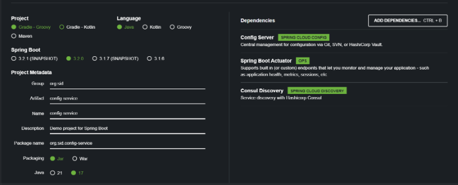
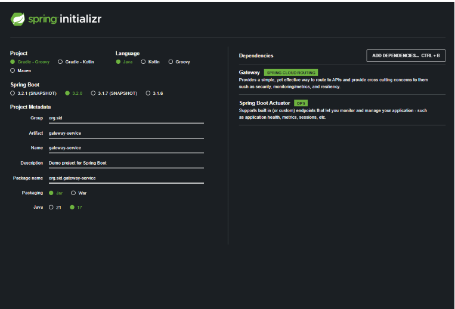
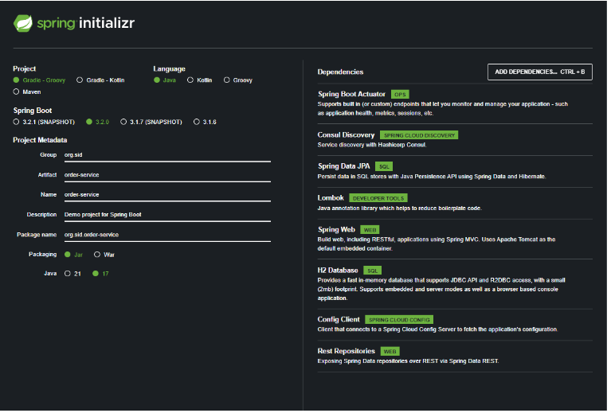
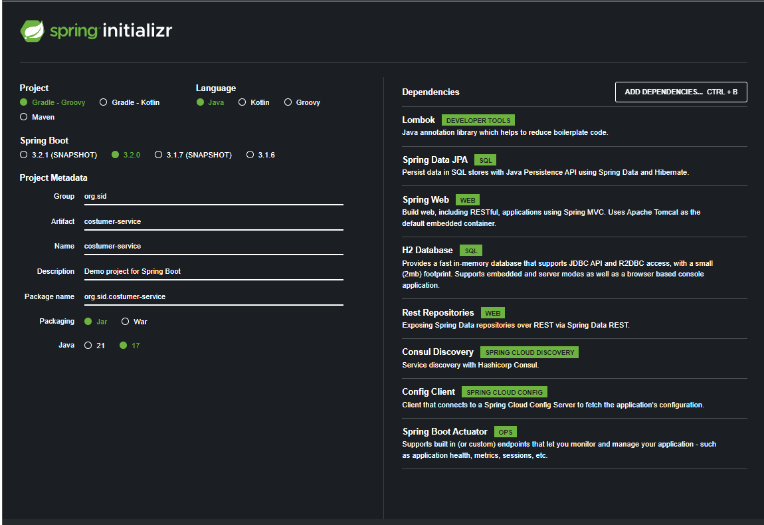
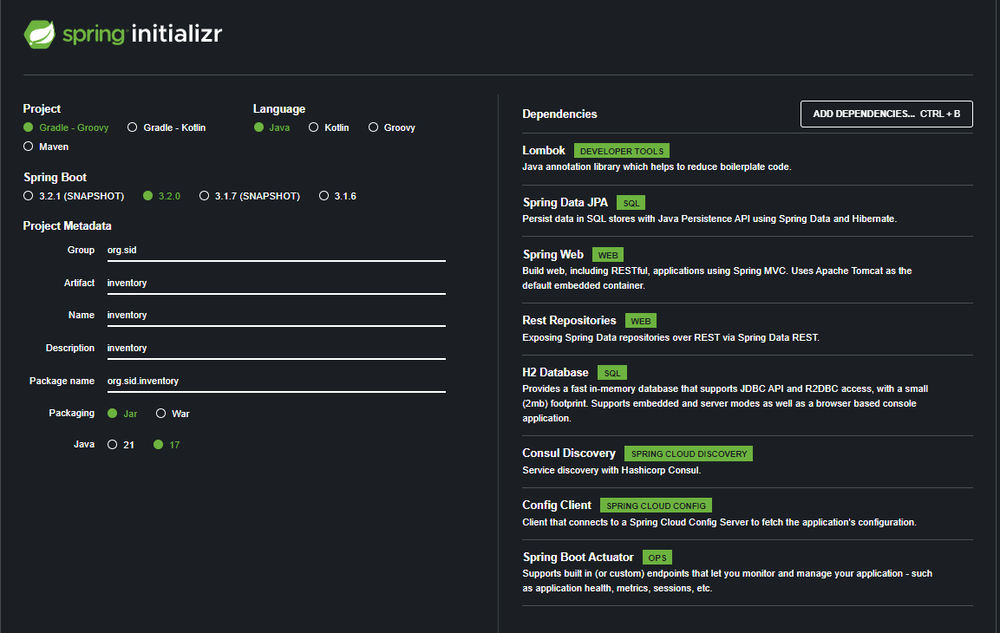
demarer serveur consul
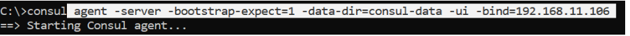
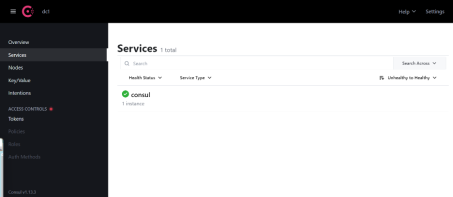
creer un service de configuration pour une configuration centralise (local folder)
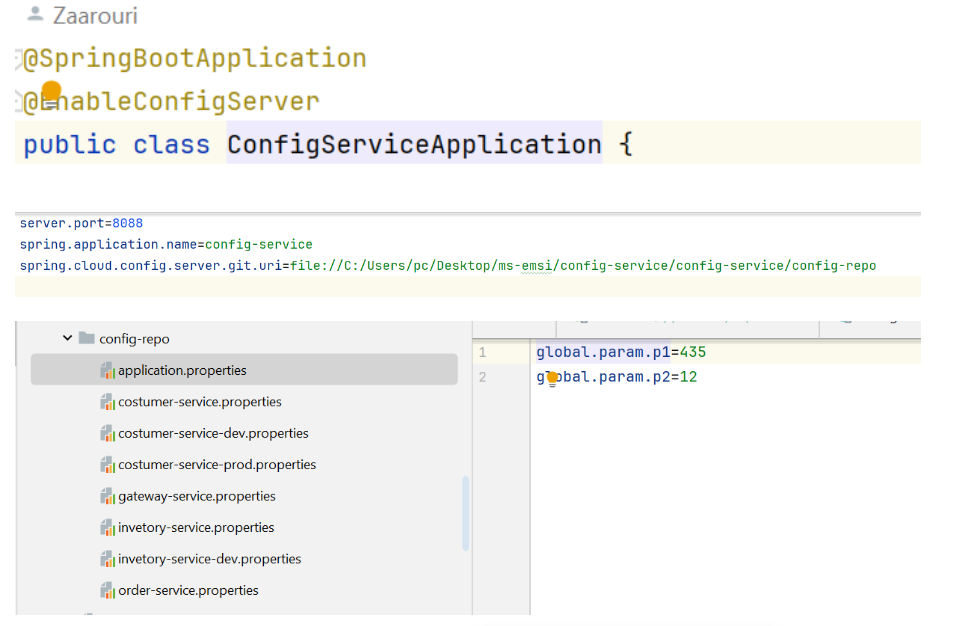
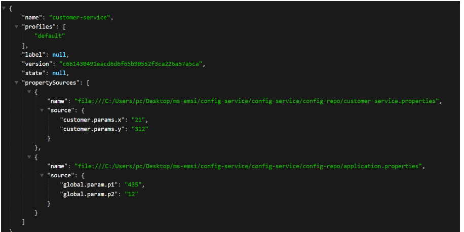
pour customer service on va specifier le port de config server
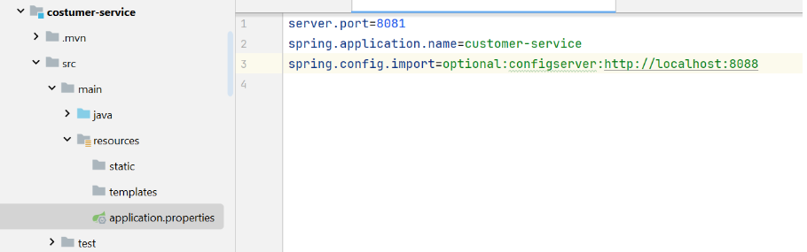
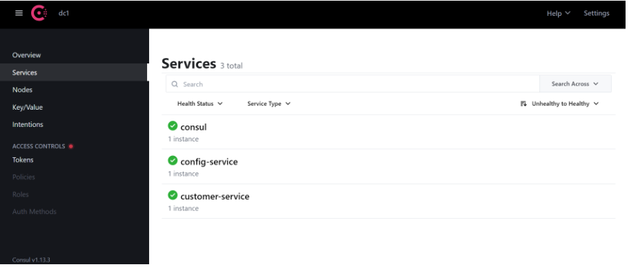
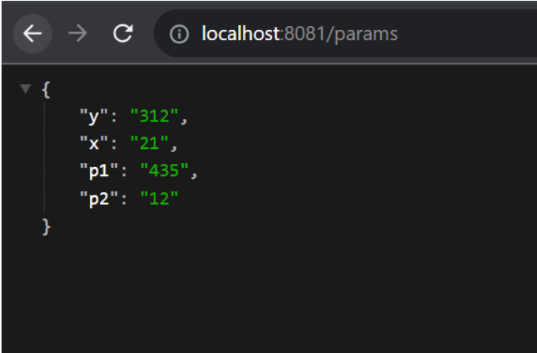